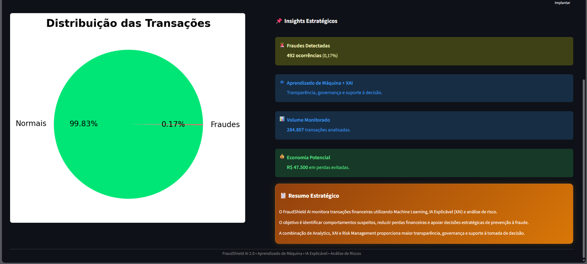
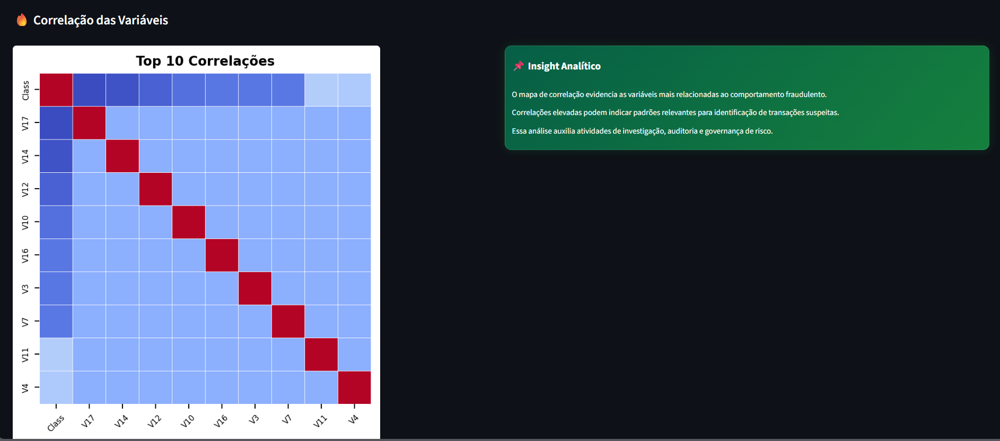
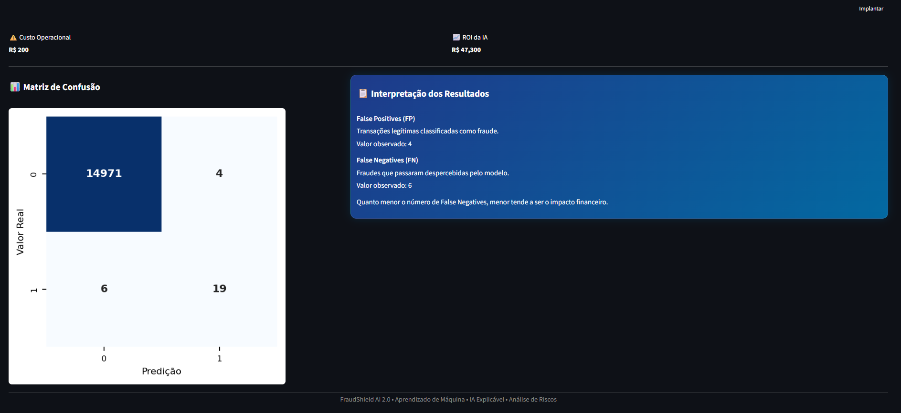
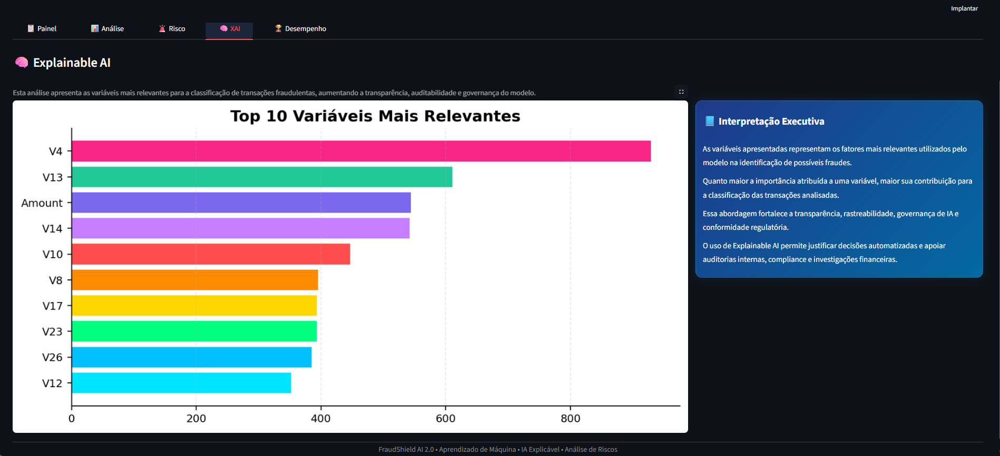
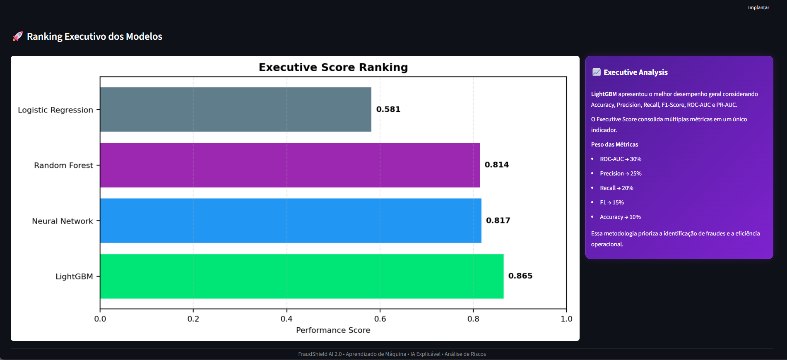

<p align="center">
  
</p>

<h1 align="center">FraudShield AI 2.0</h1>

<h3 align="center">
Detecção Inteligente de Fraudes Financeiras com Machine Learning, Explainable AI (XAI) e Risk Analytics
</h3>

<p align="center">
  
  
  
  
  
  
</p>
---


## 🎥 Demonstração em Vídeo

Link será disponibilizado após a publicação do vídeo.

🔗 **Link:** INSIRA_AQUI_SEU_LINK_DO_GOOGLE_DRIVE_OU_YOUTUBE

---

### Notebook Google Colab

🔗 **Link:** https://colab.research.google.com/drive/11UPQ7GKEBcStHGm1Ee5-bAqYV89Ami-w?usp=sharing

---

# 📌 Sobre o Projeto

O FraudShield AI 2.0 é uma plataforma de análise e detecção de fraudes financeiras desenvolvida para simular cenários reais de instituições financeiras, fintechs, operadoras de cartão e empresas de meios de pagamento.

A solução utiliza algoritmos avançados de Machine Learning para identificar transações suspeitas, calcular impactos financeiros e fornecer explicabilidade das decisões através de técnicas de Explainable AI (XAI).

Além da modelagem preditiva, a plataforma inclui um dashboard executivo interativo voltado à análise de risco, performance e tomada de decisão estratégica.

---

# 🎯 Problema de Negócio

Fraudes financeiras geram bilhões em prejuízos anualmente para empresas e instituições financeiras.

Os principais desafios são:

- Detecção rápida e precisa de fraudes
- Redução de perdas financeiras operacionais
- Minimização de falsos positivos
- Transparência e auditabilidade dos modelos
- Conformidade com práticas de governança e risco

O FraudShield AI foi desenvolvido para endereçar esses desafios com uso aplicado de Inteligência Artificial.

---

# 🏦 Aplicações Corporativas

A solução pode ser aplicada em:

- Bancos
- Fintechs
- Seguradoras
- Operadoras de Cartão
- Gateways de Pagamento
- Marketplaces
- E-commerces
- Instituições Financeiras Digitais

---

# 🚀 Funcionalidades 

## 📊 Executive Dashboard

- KPIs de fraude em tempo real  
- Volume e distribuição de transações  
- Taxa de fraude e perdas estimadas  

---

## 📈 Risk Analytics

- Matriz de confusão e métricas de risco  
- Exposição financeira residual  
- ROI da solução de IA  

---

## 🧠 Explainable AI (XAI)

- Importância de variáveis (feature importance)  
- Interpretação de decisões do modelo  
- Suporte à auditoria e compliance  

---

## 🏆 Model Performance

- Comparação entre algoritmos  
- Seleção automática do melhor modelo  
- Ranking baseado em métrica composta  

---

# 🧠 Modelos Utilizados 

| Modelo | Descrição |
|--------|-----------|
| Logistic Regression | Modelo baseline interpretável |
| Random Forest | Ensemble robusto baseado em árvores |
| LightGBM | Gradient Boosting de alta performance |
| Multilayer Perceptron (MLP) | Rede neural para padrões não lineares |

---

# ⚙️ Pipeline da Solução

```text
Dataset
    ↓
Pré-processamento
    ↓
Padronização
    ↓
SMOTE
    ↓
Treinamento dos Modelos
    ↓
Avaliação
    ↓
Explainable AI
    ↓
Dashboard Executivo
```

---

# 📊 Métricas Avaliadas

A plataforma avalia os modelos utilizando:

- Accuracy
- Precision
- Recall
- F1 Score
- ROC-AUC
- PR-AUC

Além disso, é calculado um indicador proprietário:

### Executive Score

```text
ROC-AUC → 30%
Precision → 25%
Recall → 20%
F1 Score → 15%
Accuracy → 10%
```

Esse score permite identificar automaticamente o modelo mais eficiente para o contexto de fraude financeira.

---

# 💰 Análise Financeira

A solução traduz desempenho técnico em impacto de negócio:

- Estimativa de perdas evitadas  
- Cálculo de exposição ao risco  
- Custo operacional da operação antifraude  
- ROI da implementação de IA  

---

# ⭐ Diferenciais do Projeto 

- ✔ Plataforma completa de detecção de fraudes end-to-end  
- ✔ Integração de Machine Learning + XAI + Risk Analytics  
- ✔ Métrica proprietária de avaliação de modelos (Business Score)  
- ✔ Simulação de ambiente corporativo real (banco/fintech)  
- ✔ Dashboard executivo interativo em Streamlit  
- ✔ Foco em decisão orientada a dados (Data-Driven Decision Making)

---

# 📊 Business Impact

A solução transforma resultados de Machine Learning em impacto financeiro direto, permitindo mensuração real do valor gerado pelo sistema de detecção de fraudes.

## 💰 Indicadores de Negócio (Reais)

- 💵 Perdas financeiras evitadas: R$ 47.500  
- ⚖️ Exposição residual ao risco: R$ 15.000  
- 📉 Custo operacional da solução: R$ 200  
- 🚀 ROI da IA: R$ 47.300  

## 📈 Interpretação do ROI

O ROI da solução é calculado com base na diferença entre as perdas financeiras evitadas e os custos operacionais do modelo.

Esse resultado demonstra que a implementação da IA gera retorno financeiro positivo imediato, com alto impacto na mitigação de risco e custo operacional mínimo.

## 🧠 Valor de Negócio

A aplicação do modelo de detecção de fraudes contribui diretamente para:

- Redução efetiva de perdas financeiras em transações suspeitas  
- Otimização da gestão de risco e exposição residual  
- Eficiência operacional com automação do processo de detecção  
- Suporte à tomada de decisão baseada em dados em nível executivo  
- Fortalecimento da governança e monitoramento de fraudes  

---

# 📂 Estrutura do Projeto

```text
FraudShield-AI/
│
├── README.md
├── logo.png
├── requirements.txt
│
├── app.py
├── dashboard.py
├── fraud_statistics.py
├── risks.py
├── xai.py
├── performance.py
├── process.py
├── evaluation.py
├── explainability.py
├── models.py
├── data_loader.py
├── financial_metrics.py
├── styles.py
│
└── producer.py
```

---

# 🛠️ Tecnologias Utilizadas

### Linguagem

- Python

### Machine Learning

- Scikit-Learn
- LightGBM
- Imbalanced-Learn (SMOTE)

### Manipulação de Dados

- Pandas
- NumPy

### Visualização

- Matplotlib
- Seaborn

### Dashboard

- Streamlit

---

# 📦 Instalação

Clone o repositório:

```bash
git clone https://github.com/SEU-USUARIO/FraudShield-AI.git
```

Entre na pasta:

```bash
cd FraudShield-AI
```

Instale as dependências:

```bash
pip install -r requirements.txt
```

---

# ▶️ Executando a Aplicação

```bash
streamlit run app.py
```

---

# 📸 Telas da Plataforma

## Painel Executivo



---

## Analytics



---

## Risk Management



---

## Explainable AI



---

## Performance




---

# 👩‍💻 Autora

**Barbara Nascimento de Freitas Silva**

Projeto desenvolvido para demonstração de competências em:

- Data Science
- Machine Learning
- Explainable AI
- Analytics
- Risk Management
- Visualização de Dados

---

<p align="center">

🛡️ FraudShield AI 2.0

Machine Learning • Explainable AI • Financial Risk Analytics

</p>
